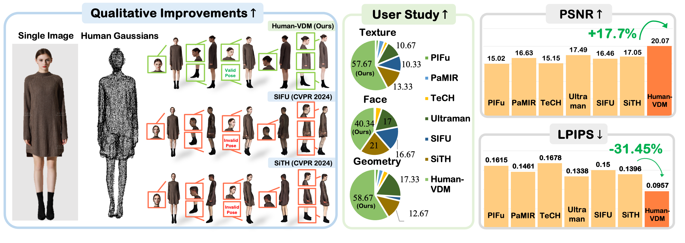

<div align="center">

# Human-VDM: Learning Single-Image 3D Human Gaussian Splatting from Video Diffusion Models
<div>
    <a href='https://ieeexplore.ieee.org/author/37089972264' target='_blank'>Zhibin Liu</a><sup> 1</sup></a>&emsp;
    <a href='https://www.sysu-hcp.net/faculty/wuhefeng.html' target='_blank'>Hefeng Wu</a><sup> 1</sup></a>&emsp;
    <a href='https://aviralchharia.github.io/' target='_blank'>Aviral Chharia</a><sup> 2</sup>&emsp;
    <a href='https://yanyan-li.github.io/about_me/' target='_blank'>Yanyan Li</a><sup> 3</sup>&emsp;</br>
    <a href='https://www.comp.nus.edu.sg/~leegh/index.html' target='_blank'>Gim Hee Lee</a><sup> 3</sup>&emsp;
    <a href='https://www.haoyed.com/' target='_blank'>Haoye Dong</a><sup> 2, 3†</sup>&emsp;</br>
</div>
<div>
    <sup>1</sup>Sun Yat-sen University&emsp;<sup>2</sup>Carnegie Mellon University&emsp;<br>
    <sup>3</sup>National University of Singapore
</div>
<div>
    <b>arXiv 2024</b>
</div>
<br>

  <a href="https://arxiv.org/abs/2409.02851"></a>
  <a href="https://human-vdm.github.io/Human-VDM/"></a>
  [](https://github.com/Human-VDM/Human-VDM)

---



<strong> Given a single RGB human image, Human-VDM aims to generate high-fidelity 3D human.</strong> 
Human-VDM preserves face identity, delivers realistic texture, ensures accurate geometry, and maintains 
a valid pose of the generated 3D human, surpassing the current state-of-the-art models. :open_book: For additional 
visual results and comparisons, check out our <a href="https://human-vdm.github.io/Human-VDM/" target="_blank">project page</a>

</div>

---

## :rocket: **Updates**
- <i>More Coming Soon</i>
- 🔲 **Coming Soon!**: Human-VDM Codes.
- ✅ **Sep. 05, 2024**: We released the Human-VDM paper on arXiv.
- ✅ **Sep. 04, 2024**: We released the Human-VDM project page. <i>Check it out!</i>


## :open_book: **Abstract**
Generating lifelike 3D humans from a single RGB image remains a challenging task in computer vision, as it requires accurate modeling of geometry, high-quality texture, and plausible unseen parts. Existing methods typically use multi-view diffusion models for 3D generation, but they often face inconsistent view issues, which hinder high-quality 3D human generation. To address this, we propose Human-VDM, a novel method for generating 3D human from a single RGB image using Video Diffusion Models. Human-VDM provides temporally consistent views for 3D human generation using Gaussian Splatting. It consists of three modules: a view-consistent human video diffusion module, a video augmentation module, and a Gaussian Splatting module. First, a single image is fed into a human video diffusion module to generate a coherent human video. Next, the video augmentation module applies super-resolution and video interpolation to enhance the textures and geometric smoothness of the generated video. Finally, the 3D Human Gaussian Splatting module learns lifelike humans under the guidance of these high-resolution and view-consistent images. Experiments demonstrate that Human-VDM achieves high-quality 3D human from a single image, outperforming state-of-the-art methods in both generation quality and quantity.

## :bookmark_tabs: Citation
If you find our work useful for your project, please consider adding a star to this repo and citing the paper:
```bibtex
@misc{liu2024humanvdmlearningsingleimage3d,
      title={Human-VDM: Learning Single-Image 3D Human Gaussian Splatting from Video Diffusion Models}, 
      author={Zhibin Liu and Haoye Dong and Aviral Chharia and Hefeng Wu},
      year={2024},
      eprint={2409.02851},
      archivePrefix={arXiv},
      primaryClass={cs.CV},
      url={https://arxiv.org/abs/2409.02851}, 
}
